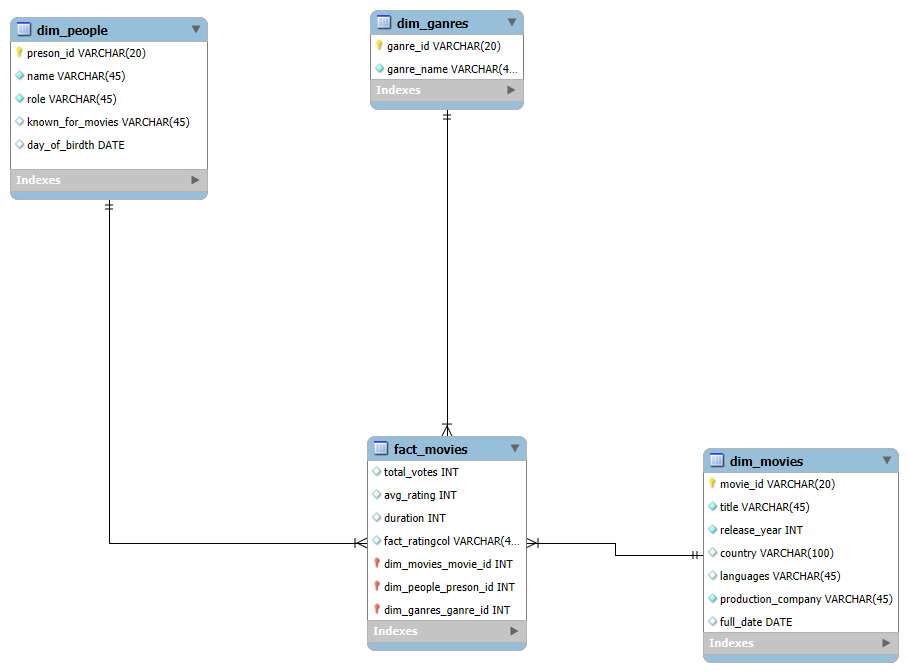

 **Proces ETL pre databázu IMDb**
 ____

 Tento repozitár obsahuje implementáciu procesu ETL v programe Snowflake na analýzu údajov databázy IMDb. Projekt sa zameriava na štúdium správania používateľov, žánrov a popularity filmov na základe ich hodnotení. Výsledný dátový model umožňuje viacrozmernú analýzu a vizualizáciu kľúčových ukazovateľov.

___
## **1. Úvod a popis zdrojových dát** 
Cieľom projektu je analyzovať údaje týkajúce sa filmov, žánrov, režisérov, hercov a ich hodnotenia. Táto analýza nám umožňuje identifikovať trendy v žánroch, najpopulárnejšie filmy a kľúčové údaje o hodnotení.

Údaje obsahujú päť hlavných tabuliek:
- **movie** 
- **rating** .
- **ganre** 
- **director_mapping**
- **role_mapping**
- **names**


Účelom ETL procesu bolo tieto dáta pripraviť, transformovať a sprístupniť pre viacdimenzionálnu analýzu.

---

### **1.1 Dátová architektúra**

### **ERD diagram**
Surové dáta sú usporiadané v relačnom modeli, ktorý je znázornený na entitno-relačnom diagrame (ERD):

<p align="center">
  
  <br>
  <em>Obrázok 1 Entitno-relačná schéma IMDB</em>
</p>

___
### 2. **Dimenzionálny model**.
Vyvinuli sme model v tvare hviezdy (**Hviezdna schéma**) na viacrozmernú analýzu. Centrálnou tabuľkou je faktografická tabuľka `fact_movies`, ktorá je prepojená s nasledujúcimi dimenziami:
- **dim_movies**: Podrobné informácie o filmoch.
- **dim_žánre**: Informácie o žánroch.
- **dim_people**: Informácie o ľuďoch (režiséri, herci).
- **dim_dates**: Informácie o dátume (deň, mesiac, rok).

Štruktúra hviezdicového modelu je znázornená na diagrame nižšie. Diagram ukazuje prepojenia medzi faktovou tabuľkou a dimenziami, čo zjednodušuje pochopenie a implementáciu modelu.
<p align="center">
  
  <br>
  <em>Obrázok 2 Schéma hviezdy pre IMDB</em>
</p>

___
## **3. ETL proces v Snowflake**
ETL proces pozostával z troch hlavných fáz: `extrahovanie` (Extract), `transformácia` (Transform) a `načítanie` (Load). Tento proces bol implementovaný v Snowflake s cieľom pripraviť zdrojové dáta zo staging vrstvy do viacdimenzionálneho modelu vhodného na analýzu a vizualizáciu.
___
### **3.1 Extract (Extrahovanie dát)**
Dáta zo zdrojového datasetu (formát `.csv`) boli najprv nahraté do Snowflake prostredníctvom interného stage úložiska s názvom `my_stage`. Stage v Snowflake slúži ako dočasné úložisko na import alebo export dát. Vytvorenie stage bolo zabezpečené príkazom:

#### Príklad kódu:
```sql
CREATE OR REPLACE STAGE imdbSt;
```
Do stage boli následne nahraté súbory obsahujúce údaje o knihách, používateľoch, hodnoteniach, zamestnaniach a úrovniach vzdelania. Dáta boli importované do staging tabuliek pomocou príkazu `COPY INTO`. Pre každú tabuľku sa použil podobný príkaz:

```sql
COPY INTO name_staging
FROM @imdbSt/names.csv
FILE_FORMAT = (TYPE = 'CSV' FIELD_OPTIONALLY_ENCLOSED_BY = '"' SKIP_HEADER = 1)
ON_ERROR = 'CONTINUE';
```

V prípade nekonzistentných záznamov bol použitý parameter `ON_ERROR = 'CONTINUE'`, ktorý zabezpečil pokračovanie procesu bez prerušenia pri chybách.

---
### **3.1 Transfor (Transformácia dát)**

V tejto fáze boli údaje z tabuliek etapy vyčistené, transformované a obohatené. Hlavným cieľom bolo pripraviť dimenzie a tabuľku faktov, ktoré umožnia jednoduchú a efektívnu analýzu.

---

### Návrh dimenzií

Dimenzie boli navrhnuté tak, aby poskytovali kontext pre tabuľku faktov. Nižšie je uvedená transformačná logika pre každú dimenziu.

#### **Dimenzia: dim_movies**
Dimenzia `dim_movies` poskytuje podrobné informácie o filmoch vrátane názvu, roku, trvania, krajiny a produkčnej spoločnosti. Táto dimenzia sa považuje za **SCD typu 0**, pretože údaje zostávajú v čase statické. Atribúty ako názov filmu alebo produkčná spoločnosť sa nemenia.

```sql
CREATE OR REPLACE TABLE dim_movies AS
SELECT DISTINCT
    id AS movie_id,
    title,
    realese_year,
    duration,
    country,
    languages,
    production_company
FROM movies_staging;

## Dimenzia: `dim_genres`.
Dimenzia `dim_genres` obsahuje jedinečné žánre používané na klasifikáciu filmov. Umožňuje jednoducho analyzovať filmy podľa ich žánrov.

```ql
CREATE OR REPLACE TABLE dim_genres AS 
SELECT DISTINCT
    ROW_NUMBER() OVER (ORDER BY genre) AS genre_id,  -- jedinečné ID pre každý žáner
    genre AS genre_name                             
FROM genres_staging;
```

### Charakteristika:
- Typ **SCD:** Typ 0 (statické údaje).
- **Kľúčové atribúty:**
  - `genre_id` - jedinečný identifikátor žánru.
  - `ganre_name` - Názov žánru.


### Dimenzia: `dim_people`
Dimenzia `dim_people` uchováva informácie o účastníkoch filmového priemyslu, ako sú herci, režiséri a iné úlohy. Obsahuje ich mená, kategórie rolí a slávne filmy.

```ql
CREATE OR REPLACE TABLE dim_people AS
SELECT DISTINCT
    n.id AS person_id,
    n.name,
    r.category AS role,
    n.known_for_movies,
    n.date_of_birdth,
FROM name_staging n
LEFT JOIN role_mapping_staging r ON n.id = r.name_id;
```

### Charakteristiky:
- **SCD typ:** Typ 1 (aktualizovateľné údaje).
- Kľúčové atribúty:**.
  - `person_id` - jedinečný identifikátor osoby.
  - `name` - meno.
  - `role` - kategória roly (napríklad režisér, herec).
  - `date_of_birdth`-rok narodenial.

---
### Dimenzia: `dim_dates`.
Dimenzia `dim_dates` poskytuje časový kontext pre analýzu vrátane dňa, mesiaca, roka a ďalších atribútov.

```ql
CREATE OR REPLACE TABLE dim_dates AS
SELECT DISTINCT
    ROW_NUMBER() OVER (ORDER BY date_published) AS date_id,
    date_published AS full_date,
    YEAR(date_published) AS year,
    MONTH(date_published) AS month,
    DAY(date_published) AS day
FROM movies_staging;
```

### Charakteristiky:
- **SCD typ:** Typ 0 (statické údaje).
- Kľúčové atribúty:**.
  - `date_id` - jedinečný identifikátor dátumu.
  - `full_date` - Úplný dátum.
  - `rok`, `mesiac`, `deň`, - časové atribúty.

---


### Faktová tabuľka: `fact_movies`.
Tabuľka faktov `fact_movies` obsahuje všetky kľúčové vzťahy medzi dimenziou a metrikami, ako je trvanie, počet hlasov, hodnotenie a identifikátory žánru a osoby.

```ql
CREATE OR REPLACE TABLE fact_movies AS
SELECT DISTINCT
    m.id AS movie_id,                 
    dg.genre_id,                      
    p.person_id AS director_id,       
    d.date_id,                        
    r.total_votes,                    
    r.avg_rating,                     
    m.duration                        
FROM movies_staging m
LEFT JOIN ratings_staging r ON m.id = r.movie_id         
LEFT JOIN genres_staging g ON m.id = g.movie_id           
LEFT JOIN dim_genres dg ON g.genre = dg.genre_name        
LEFT JOIN dim_people p ON p.role = 'Director' AND m.id = p.known_for_movies 
LEFT JOIN dim_dates d ON m.date_published = d.full_date; 
```

### Vlastnosti:


- **Fakty:**
  - `avg_rating` - Priemerné hodnotenie.
  - `total_votes` - Počet hlasov.
  - `duration` - Trvanie filmu.
- Vzťahy:**
  - Súvisí so všetkými dimenziami (`dim_filmov`, `dim_žánrov`, `dim_ľudí`, `dim_dátum`).


---
 ### **3.3 Load (Načítanie dát)**
Po úspešnom vytvorení dimenzií a faktovej tabuľky boli dáta nahraté do finálnej štruktúry. Na záver boli staging tabuľky odstránené, aby sa optimalizovalo využitie úložiska:
```sql
DROP TABLE IF EXISTS movies_staging;
DROP TABLE IF EXISTS genres_staging;
DROP TABLE IF EXISTS people_staging;
DROP TABLE IF EXISTS ratings_staging;
DROP TABLE IF EXISTS dates_staging;
```
ETL proces v Snowflake umožnil spracovanie pôvodných dát z `.csv` formátu do viacdimenzionálneho modelu typu hviezda. Tento proces zahŕňal čistenie, obohacovanie a reorganizáciu údajov. Výsledný model umožňuje analýzu čitateľských preferencií a správania používateľov, pričom poskytuje základ pre vizualizácie a reporty.

---
## **4 Vizualizácia dát**
Panel obsahuje 6 vizualizácií, ktoré poskytujú základný prehľad kľúčových ukazovateľov a trendov týkajúcich sa aktivity používateľov, popularity žánrov, režisérov a hercov, ako aj finančnej analýzy.

<p align="center">
  
  <br>
  <em>Obrázok 3 Dashboard IMDB datasetu</em>
</p>

---
## Graf 1: Porovnanie počtu filmov vyrobených v USA a Indii v roku 2019
Táto vizualizácia ukazuje porovnanie počtu filmov, ktoré boli vyrobené v USA a Indii v roku 2019. Umožňuje analyzovať rozdiely v produkcii medzi týmito dvoma krajinami a identifikovať dominantnú filmovú produkciu.

```sql
SELECT 
    m.country AS country,
    COUNT(m.id) AS number_of_movies
FROM 
    movie AS m
WHERE 
    m.country IN ('USA', 'India') 
    AND m.year = 2019
GROUP BY 
    m.country
ORDER BY 
    number_of_movies DESC;

```
----
## Graf 2: Priemerná dĺžka filmov pre každý žáner
Táto vizualizácia zobrazuje priemernú dĺžku filmov pre jednotlivé žánre. Pomáha identifikovať žánre, ktoré typicky obsahujú dlhšie alebo kratšie filmy.

```sql
SELECT g.genre AS genre,
       ROUND(AVG(m.duration), 2) AS avg_duration
FROM genre AS g
INNER JOIN movie AS m ON g.movie_id = m.id
GROUP BY g.genre
ORDER BY avg_duration DESC;

```
----
## Graf 3: 10 najlepších režisérov podľa počtu nakrútených filmov
Táto vizualizácia zobrazuje 10 najproduktívnejších režisérov na základe počtu filmov, ktoré režírovali. Umožňuje analyzovať, ktorí režiséri sú najaktívnejší v priemysle.
```sql
SELECT 
    n.name AS director_name,
    COUNT(dm.movie_id) AS movie_count
FROM director_mapping dm
JOIN names n 
    ON dm.name_id = n.id
GROUP BY n.name
ORDER BY movie_count DESC
LIMIT 10;
```
---
## Graf 4: 3 najlepší režiséri v 3 najlepších žánroch s priemerným hodnotením > 8
Táto vizualizácia identifikuje troch najlepších režisérov v troch najlepších žánroch, ktorých filmy majú priemerné hodnotenie vyššie ako 8. Poskytuje pohľad na kvalitu filmov a úspešnosť režisérov.
```sql
WITH top3_genre AS (
    SELECT g.genre,
           COUNT(g.movie_id) AS movie_count
    FROM genre AS g
    INNER JOIN ratings AS r ON g.movie_id = r.movie_id
    WHERE r.avg_rating > 8
    GROUP BY g.genre
    ORDER BY movie_count DESC
    LIMIT 3
),
top3_director AS (
    SELECT n.name AS director_name,
           COUNT(g.movie_id) AS movie_count,
           ROW_NUMBER() OVER (ORDER BY COUNT(g.movie_id) DESC) AS director_rank
    FROM names AS n
    INNER JOIN director_mapping AS dm ON n.id = dm.name_id
    INNER JOIN genre AS g ON dm.movie_id = g.movie_id
    INNER JOIN ratings AS r ON r.movie_id = g.movie_id
    WHERE g.genre IN (SELECT genre FROM top3_genre)
      AND r.avg_rating > 8
    GROUP BY n.name
)
SELECT director_name, movie_count
FROM top3_director
WHERE director_rank <= 3;

```
---
## Graf 5: Najobľúbenejší herci podľa počtu odohraných úloh
Táto vizualizácia ukazuje 10 najobľúbenejších hercov a herečiek na základe počtu ich úloh vo filmoch. Umožňuje identifikovať hercov, ktorí sú najžiadanejší v priemysle.
```sql
SELECT
    n.name AS actor_name,
    COUNT(*) AS total_roles
FROM role_mapping AS rm
JOIN names AS n ON rm.name_id = n.id
WHERE rm.category IN ('actor', 'actress')
GROUP BY n.name
ORDER BY total_roles DESC
LIMIT 10;

```
---
## Graf 6: Počet filmov podľa krajín
Táto vizualizácia zobrazuje počet filmov vyrobených v jednotlivých krajinách. Pomáha analyzovať, ktoré krajiny dominujú vo filmovej produkcii.
```sql
SELECT m.country,
       COUNT(m.id) AS movie_count
FROM movie AS m
GROUP BY m.country
ORDER BY movie_count DESC
LIMIT 10;


```

Dashboard poskytuje komplexný prehľad údajov a odpovedá na dôležité otázky týkajúce sa trendov vo filmovom priemysle, popularity filmov a výkonov režisérov a hercov. Vizualizácie uľahčujú interpretáciu údajov a možno ich použiť na zlepšenie odporúčacích systémov, vývoj marketingových stratégií a analýzu filmových trendov.

-----
Autor: Ivan Veremchuk

