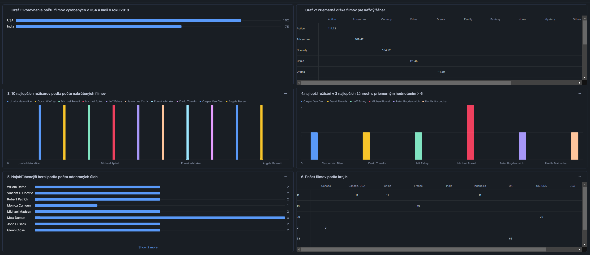

# **ETL proces pre databázu IMDb**

---

Tento repozitár obsahuje implementáciu ETL procesu v Snowflake na analýzu údajov IMDb. Projekt sa zameriava na štúdium správania používateľov, žánrov a popularity filmov na základe ich hodnotení. Výsledná model dát umožňuje viacrozmernú analýzu a vizualizáciu kľúčových ukazovateľov.

---

## **1. Úvod a popis zdrojových údajov**
Cieľom projektu je analyzovať údaje týkajúce sa filmov, žánrov, réžisérov, hercov a ich hodnotenia. Tento proces pomáha určiť trendy v žánroch, najpopulárnejšie filmy a kľúčové štatistiky.

Dáta obsahujú päť hlavných tabuliek:
- **movies**
- **ratings**
- **genres**
- **director_mapping**
- **role_mapping**
- **names**

ETL proces bol vytvorený na pripravenie, transformáciu a sprístupnenie údajov pre viacrozmernú analýzu.

---

## **1.1 Architektúra údajov**

### **ERD diagram**
Surové dáta sú organizované v relačnom modeli, ktorý je znázorněný na ERD-diagrame:

<p align="center">
  
  <br>
  <em>Obrázok 1 Entitno-relačná schéma IMDB</em>
</p>

---

## **2. Viacrozmerná modelácia**
Model bol navrhnutý v tvare hviezdy (**Star Schema**) na viacrozmernú analýzu. Centrálnou tabuľkou je faktografická tabuľka `fact_movies`, ktorá je prepojená s nasledujúcimi dimenziami:
- **dim_movies**: Podrobnosti o filmoch.
- **dim_genres**: Informácie o žánroch.
- **dim_people**: Informácie o hercoch a réžiséroch.

<p align="center">
  
  <br>
  <em>Obrázok 2 Schéma hviezdy pre IMDB</em>
</p>

---

## **3. ETL proces v Snowflake**
ETL proces zahŕňal tri hlavné fázy: `Extract`, `Transform` a `Load`. Tento proces pripravil dáta na analýzu a vizualizáciu.

---

### **3.1 Extract (Extrakcia údajov)**

Dáta boli načítané do Snowflake cez interné stage úložisko `imdbSt`. Stage bol vytvorený nasledovne:

```sql
CREATE OR REPLACE STAGE imdbSt;
```

Potom boli do neho načítané súbory obsahujúce filmy, žánre, hercov, hodnotenia a úlohy. Príklad načítania:

```sql
COPY INTO movies_staging
FROM @imdbSt/movie.csv
FILE_FORMAT = (TYPE = 'CSV' FIELD_OPTIONALLY_ENCLOSED_BY = '"' SKIP_HEADER = 1);
```

---

### **3.2 Transform (Transformácia údajov)**

V tejto fáze boli staging tabuľky transformované na dimenzie a faktografickú tabuľku.

#### **Dimenzia: dim_movies**
Obsahuje informácie o filmoch, vrátane názvu, roku, trvania a produkčnej spoločnosti.

```sql
CREATE OR REPLACE TABLE dim_movies AS
SELECT DISTINCT
    id AS movie_id,
    title,
    year,
    date_published,
    duration,
    country,
    languages,
    production_company
FROM movies_staging;
```
### Charakteristiky:
- **SCD typ:** Typ 0 (statické údaje, bez historických zmien).
- **Kľúčové atribúty:**
  - `movie_id` - Jedinečný identifikátor filmu.
  - `title` - Názov filmu.
  - `year` - Rok vydania.
  - `duration` - Trvanie filmu v minútach.
  - `country` - Krajina pôvodu.
  - `languages` - Jazyky použité vo filme.
  - `production_company` - Produkčná spoločnosť.

---


---

#### **Dimenzia: dim_genres**
Obsahuje jedinečné žánre.

```sql
CREATE OR REPLACE TABLE dim_genres AS 
SELECT DISTINCT
    ROW_NUMBER() OVER (ORDER BY genre) AS genre_id,
    genre AS genre_name                             
FROM genres_staging;
```
### Charakteristiky:
- **SCD typ:** Typ 0 (statické údaje).
- **Kľúčové atribúty:**
  - `genre_id` - Jedinečný identifikátor žánru.
  - `genre_name` - Názov žánru.
---

#### **Dimenzia: dim_people**
Uchováva informácie o hercoch a réžiséroch vrátane ich mien a rolí.

```sql
CREATE OR REPLACE TABLE dim_people AS
SELECT DISTINCT
    n.id AS person_id,
    n.name,
    r.category AS role,
    n.known_for_movies,
    n.date_of_birth
FROM name_staging n
LEFT JOIN role_mapping_staging r ON n.id = r.name_id;
```
### Charakteristiky:
- **SCD typ:** Typ 1 (aktualizácia údajov, keď sa zmenia).
- **Kľúčové atribúty:**
  - `person_id` - Jedinečný identifikátor osoby.
  - `name` - Meno osoby.
  - `role` - Úloha osoby (napr. režisér, herec).
  - `date_of_birth` - Dátum narodenia.
  - `known_for_movies` - Zoznam známych filmov.

---

#### **Faktografická tabuľka: fact_movies**
Tabuľka obsahuje vzťahy medzi dimenziami a kľúčové metriky.

```sql
CREATE OR REPLACE TABLE fact_movies AS
SELECT DISTINCT
    m.id AS movie_id,                 
    dg.genre_id,                      
    p.person_id AS director_id,                             
    r.total_votes,                    
    r.avg_rating,                     
    m.duration                        
FROM movies_staging m
LEFT JOIN ratings_staging r ON m.id = r.movie_id         
LEFT JOIN genres_staging g ON m.id = g.movie_id           
LEFT JOIN dim_genres dg ON g.genre = dg.genre_name        
LEFT JOIN dim_people p ON p.role = 'Director' AND m.id = p.known_for_movies;
```
### Charakteristiky:
- **Primárne metriky:**
  - `avg_rating` - Priemerné hodnotenie filmu.
  - `total_votes` - Celkový počet hlasov pre film.
  - `duration` - Trvanie filmu v minútach.
- **Vzťahy:**
  - Súvisí s dimenziami `dim_movies`, `dim_genres`, a `dim_people`.
- **Použitie:**
  - Základ pre analýzu hodnotení filmov podľa žánrov, režisérov a iných aspektov.

---

### **3.3 Load (Načítanie údajov)**

Na záver boli staging tabuľky odstránené:

```sql
DROP TABLE IF EXISTS movies_staging;
DROP TABLE IF EXISTS genres_staging;
DROP TABLE IF EXISTS role_mapping_staging;
DROP TABLE IF EXISTS director_mapping_staging;
DROP TABLE IF EXISTS ratings_staging;
DROP TABLE IF EXISTS name_staging;
```
## **4 Vizualizácia dát**
Panel obsahuje 6 vizualizácií, ktoré poskytujú základný prehľad kľúčových ukazovateľov a trendov týkajúcich sa aktivity používateľov, popularity žánrov, režisérov a hercov, ako aj finančnej analýzy.

<p align="center">
  
  <br>
  <em>Obrázok 3 Dashboard IMDB datasetu</em>
</p>

---
## Graf 1: Porovnanie počtu filmov vyrobených v USA a Indii v roku 2019
Táto vizualizácia ukazuje porovnanie počtu filmov, ktoré boli vyrobené v USA a Indii v roku 2019. Umožňuje analyzovať rozdiely v produkcii medzi týmito dvoma krajinami a identifikovať dominantnú filmovú produkciu.

```sql
SELECT 
    m.country AS country,
    COUNT(m.id) AS number_of_movies
FROM 
    movie AS m
WHERE 
    m.country IN ('USA', 'India') 
    AND m.year = 2019
GROUP BY 
    m.country
ORDER BY 
    number_of_movies DESC;

```
----
## Graf 2: Priemerná dĺžka filmov pre každý žáner
Táto vizualizácia zobrazuje priemernú dĺžku filmov pre jednotlivé žánre. Pomáha identifikovať žánre, ktoré typicky obsahujú dlhšie alebo kratšie filmy.

```sql
SELECT g.genre AS genre,
       ROUND(AVG(m.duration), 2) AS avg_duration
FROM genre AS g
INNER JOIN movie AS m ON g.movie_id = m.id
GROUP BY g.genre
ORDER BY avg_duration DESC;

```
----
## Graf 3: 10 najlepších režisérov podľa počtu nakrútených filmov
Táto vizualizácia zobrazuje 10 najproduktívnejších režisérov na základe počtu filmov, ktoré režírovali. Umožňuje analyzovať, ktorí režiséri sú najaktívnejší v priemysle.
```sql
SELECT 
    n.name AS director_name,
    COUNT(dm.movie_id) AS movie_count
FROM director_mapping dm
JOIN names n 
    ON dm.name_id = n.id
GROUP BY n.name
ORDER BY movie_count DESC
LIMIT 10;
```
---
## Graf 4: 3 najlepší režiséri v 3 najlepších žánroch s priemerným hodnotením > 8
Táto vizualizácia identifikuje troch najlepších režisérov v troch najlepších žánroch, ktorých filmy majú priemerné hodnotenie vyššie ako 8. Poskytuje pohľad na kvalitu filmov a úspešnosť režisérov.
```sql
WITH top3_genre AS (
    SELECT g.genre,
           COUNT(g.movie_id) AS movie_count
    FROM genre AS g
    INNER JOIN ratings AS r ON g.movie_id = r.movie_id
    WHERE r.avg_rating > 8
    GROUP BY g.genre
    ORDER BY movie_count DESC
    LIMIT 3
),
top3_director AS (
    SELECT n.name AS director_name,
           COUNT(g.movie_id) AS movie_count,
           ROW_NUMBER() OVER (ORDER BY COUNT(g.movie_id) DESC) AS director_rank
    FROM names AS n
    INNER JOIN director_mapping AS dm ON n.id = dm.name_id
    INNER JOIN genre AS g ON dm.movie_id = g.movie_id
    INNER JOIN ratings AS r ON r.movie_id = g.movie_id
    WHERE g.genre IN (SELECT genre FROM top3_genre)
      AND r.avg_rating > 8
    GROUP BY n.name
)
SELECT director_name, movie_count
FROM top3_director
WHERE director_rank <= 3;

```
---
## Graf 5: Najobľúbenejší herci podľa počtu odohraných úloh
Táto vizualizácia ukazuje 10 najobľúbenejších hercov a herečiek na základe počtu ich úloh vo filmoch. Umožňuje identifikovať hercov, ktorí sú najžiadanejší v priemysle.
```sql
SELECT
    n.name AS actor_name,
    COUNT(*) AS total_roles
FROM role_mapping AS rm
JOIN names AS n ON rm.name_id = n.id
WHERE rm.category IN ('actor', 'actress')
GROUP BY n.name
ORDER BY total_roles DESC
LIMIT 10;

```
---
## Graf 6: Počet filmov podľa krajín
Táto vizualizácia zobrazuje počet filmov vyrobených v jednotlivých krajinách. Pomáha analyzovať, ktoré krajiny dominujú vo filmovej produkcii.
```sql
SELECT m.country,
       COUNT(m.id) AS movie_count
FROM movie AS m
GROUP BY m.country
ORDER BY movie_count DESC
LIMIT 10;


```

Dashboard poskytuje komplexný prehľad údajov a odpovedá na dôležité otázky týkajúce sa trendov vo filmovom priemysle, popularity filmov a výkonov režisérov a hercov. Vizualizácie uľahčujú interpretáciu údajov a možno ich použiť na zlepšenie odporúčacích systémov, vývoj marketingových stratégií a analýzu filmových trendov.

-----
Autor: Ivan Veremchuk

